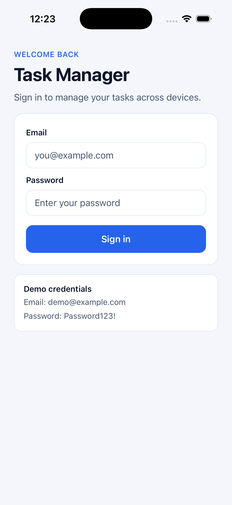
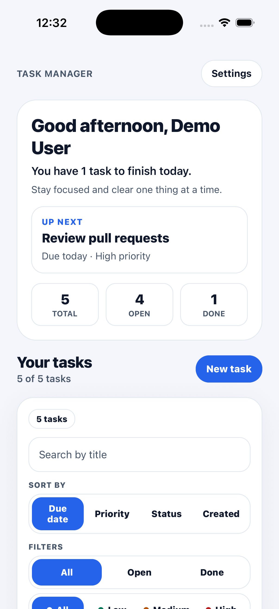
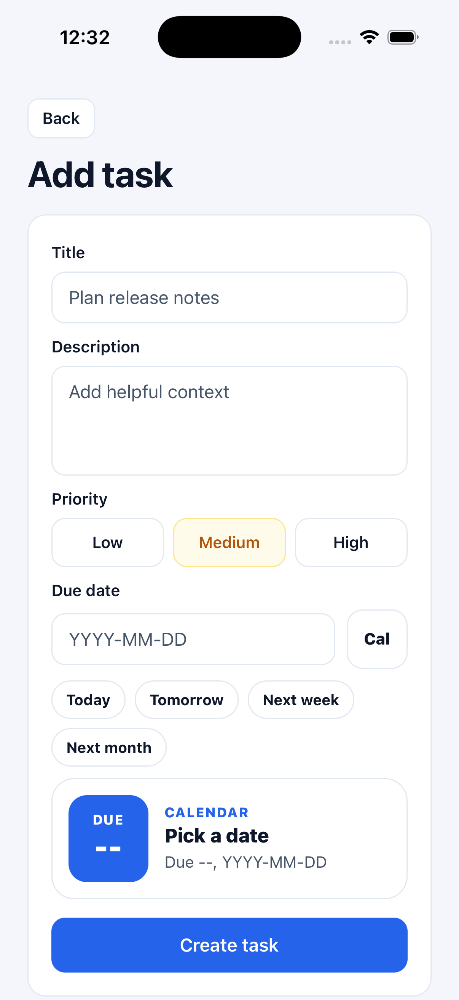
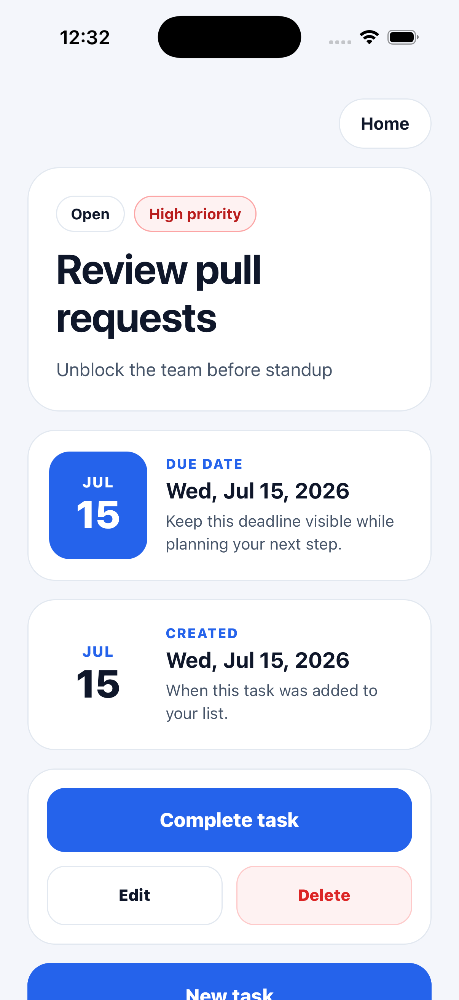
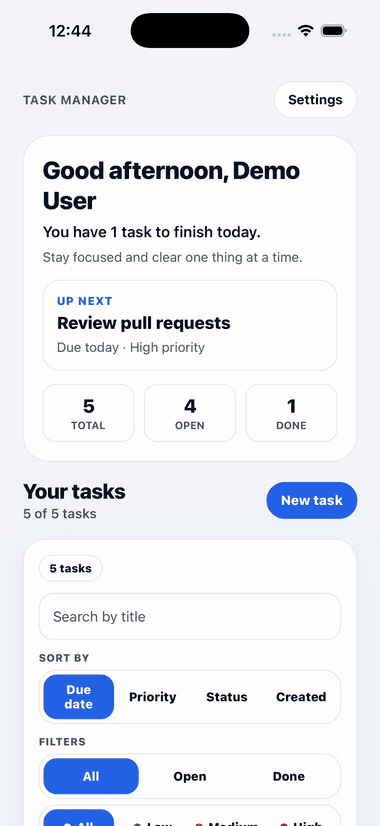

# Mobile Task Manager Automation

[](./.nvmrc)
[](./app)
[](./app/tsconfig.json)
[](https://github.com/AKogut/mobile-task-manager-automation/actions/workflows/nightly-e2e.yml)
[](https://akogut.github.io/mobile-task-manager-automation/)
[](./LICENSE)

> A realistic **React Native** task manager for **iOS** and **Android**, built as a single subject to design, implement, and compare three mobile test-automation approaches — cross-platform and native — behind one **CI/CD** pipeline.

**The idea.** Most testing portfolios pair one framework with a throwaway app. This one inverts that: a genuine iOS + Android product — authentication, task CRUD, search, filtering, sorting, and local persistence — becomes the shared subject for three independent automation suites. The same user journeys are verified through **Appium/WebdriverIO** (cross-platform), **XCUITest** (native iOS), and **Espresso** (native Android), so the trade-offs between a WebDriver driver and each platform's own runtime are visible side by side rather than argued in the abstract. One nightly pipeline runs all of them and publishes a single combined report.

## Screenshots

|                  Login                  |                   Home                   |                   Add task                   |                  Task details                  |
| :-------------------------------------: | :--------------------------------------: | :------------------------------------------: | :--------------------------------------------: |
|  |  |  |  |

<p align="center">
  
</p>

<sub>Captured on the iOS Simulator with a seeded UI-test state (`-uitest-authed` + `-uitest-tasks`).</sub>

## Highlights

- **47 cross-platform · 47 native iOS · 46 native Android** test cases, every one traced to a shared, versioned [test-case catalogue](./docs/test-cases/).
- **The same journeys, three runtimes.** A WebDriver driver (Appium) and each platform's own test runtime (XCUITest, Espresso) validate identical flows, making their trade-offs directly comparable.
- **One nightly pipeline** orchestrates all four drivers and publishes a single aggregated [live report](https://akogut.github.io/mobile-task-manager-automation/) to GitHub Pages.
- **Engineering depth, not just green checks.** Launch-argument state seeding cut the heaviest test setup by ~78%; CI failures were root-caused (ABI mismatches, emulator geometry, runner timeouts) rather than papered over.
- **Strict quality gates** — TypeScript strict mode, ESLint, Prettier, and unit tests enforced on every commit and PR.

## Tech stack

| Area                   | Stack                                                                                   |
| ---------------------- | --------------------------------------------------------------------------------------- |
| **App**                | React Native, TypeScript, React Navigation, Zustand, AsyncStorage, React Hook Form, Zod |
| **Cross-platform E2E** | TypeScript, Appium 3, WebdriverIO 9                                                     |
| **iOS automation**     | Swift, XCUITest                                                                         |
| **Android automation** | Kotlin, Espresso                                                                        |
| **CI/CD**              | GitHub Actions, Android Emulator, iOS Simulator                                         |

## Repository structure

```text
mobile-task-manager-automation/
├── app/                 # React Native application
├── appium-tests/        # Appium + WebdriverIO E2E suite
├── ios-tests/           # Swift + XCUITest
├── android-tests/       # Kotlin + Espresso
└── docs/                # Architecture and guides
```

See [docs/architecture.md](./docs/architecture.md) for diagrams and design decisions.
See [docs/build-and-run.md](./docs/build-and-run.md) for local build, simulator, and device commands.
See [docs/releases.md](./docs/releases.md) for publishing downloadable Android APKs through GitHub Releases.

## Features

### Authentication

- Login and logout with validation
- Session persisted via AsyncStorage — app re-opens authenticated
- Demo credentials shown on login screen

### Tasks

- Create, edit, delete, mark completed
- Search by title
- Filter by status (All / Open / Done) and priority (All / Low / Medium / High)
- Sort by due date, priority, status, or created date
- Active filter count badge and one-tap clear filters
- Due date and created date displayed on task detail screen
- Tasks persisted locally via AsyncStorage

### Settings

- Account info (name, email)
- Logout

## Getting started

### Prerequisites

- **Node.js** 22.22+ ([nvm](https://github.com/nvm-sh/nvm): `nvm use` reads `.nvmrc`)
- **JDK** 17 for Android (`.java-version`)
- **Ruby** 3.2.2 for CocoaPods (`.ruby-version`)
- **Xcode** (iOS) with CocoaPods
- **Android Studio** with SDK and emulator
- **Watchman** (recommended on macOS)

### Install

```bash
npm run setup
```

This installs root tooling, React Native app dependencies, Ruby gems, and iOS CocoaPods.

### Run the app

From the repository root:

```bash
npm run app:start    # Metro bundler
npm run app:ios      # iOS Simulator
npm run app:android  # Android Emulator
```

One-shot setup and run commands:

```bash
npm run app:ios:setup
npm run app:android:setup
```

Or from `app/`:

```bash
npm run start
npm run ios
npm run android
```

## Development workflow

| Command                | Description                     |
| ---------------------- | ------------------------------- |
| `npm run lint`         | ESLint for the React Native app |
| `npm run typecheck`    | TypeScript strict check         |
| `npm run format`       | Prettier write                  |
| `npm run format:check` | Prettier check (CI)             |
| `npm run app:test`     | Jest unit tests                 |

**Git hooks** (Husky + lint-staged) run ESLint and Prettier on staged files before each commit.

## Test automation

Three suites cover the same product behavior from complementary angles — one
cross-platform driver plus a native suite per platform — all traced back to the
shared [test cases](./docs/test-cases/):

| Suite          | Stack                    | Cases | Path             | Docs                                |
| -------------- | ------------------------ | ----- | ---------------- | ----------------------------------- |
| Cross-platform | Appium 3 + WebdriverIO 9 | 47    | `appium-tests/`  | [README](./appium-tests/README.md)  |
| iOS native     | Swift + XCUITest         | 47    | `ios-tests/`     | [README](./ios-tests/README.md)     |
| Android native | Kotlin + Espresso        | 46    | `android-tests/` | [README](./android-tests/README.md) |

The iOS XCUITest suite mirrors the Appium coverage case-for-case (auth, task
CRUD, complete/reopen, search, and filters), so the same behavior is validated
through both a WebDriver driver and the native XCTest runtime.

### Combined report

A single [**Nightly E2E**](https://github.com/AKogut/mobile-task-manager-automation/actions/workflows/nightly-e2e.yml)
workflow orchestrates every suite and publishes one combined
[**live report**](https://akogut.github.io/mobile-task-manager-automation/) to
GitHub Pages, with a card per driver:

- [Appium iOS](https://akogut.github.io/mobile-task-manager-automation/ios/) — Allure
- [Appium Android](https://akogut.github.io/mobile-task-manager-automation/android/) — Allure
- [Native iOS](https://akogut.github.io/mobile-task-manager-automation/ios-native/) — XCUITest
- [Native Android](https://akogut.github.io/mobile-task-manager-automation/android-native/) — Espresso

The suite workflows are reusable (`workflow_call`) and can also be dispatched
on demand; only the nightly orchestrator publishes Pages, so per-suite runs
never clobber the shared site.

### Run locally

```bash
# Cross-platform (Appium)
cd appium-tests
yarn install
yarn test:ios        # or: yarn test:android
yarn report:open:ios # or: yarn report:open:android
```

```bash
# iOS native (XCUITest) — Metro must be running
npm run app:start
npm run ios:test         # build + run on the iOS Simulator
npm run ios:test:report  # HTML report → ios-tests/report.html
```

```bash
# Android native (Espresso) — emulator only, no Metro needed
emulator -avd Pixel_9_Pro_15 &
npm run android:test  # ./gradlew :app:connectedAndroidTest
```

See the [Appium README](./appium-tests/README.md),
[iOS README](./ios-tests/README.md), and
[Android README](./android-tests/README.md) for prerequisites, environment
variables, and report layout.

## Author

**Andrii Kohut** — [GitHub](https://github.com/AKogut) · a.kogut01@gmail.com

## License

Released under the [MIT License](./LICENSE). © 2026 Andrii Kohut.
