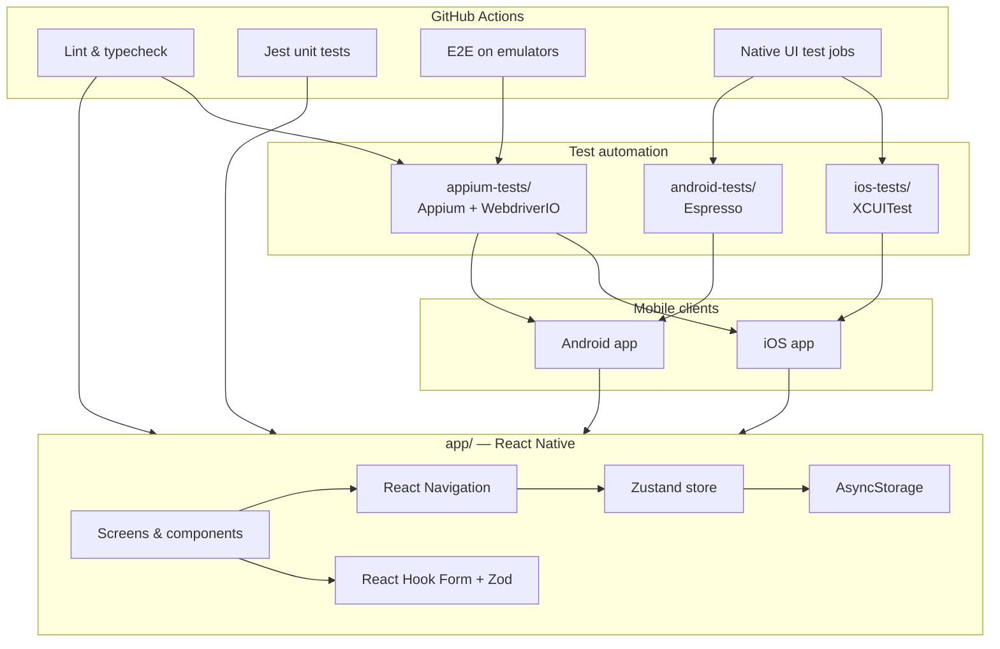
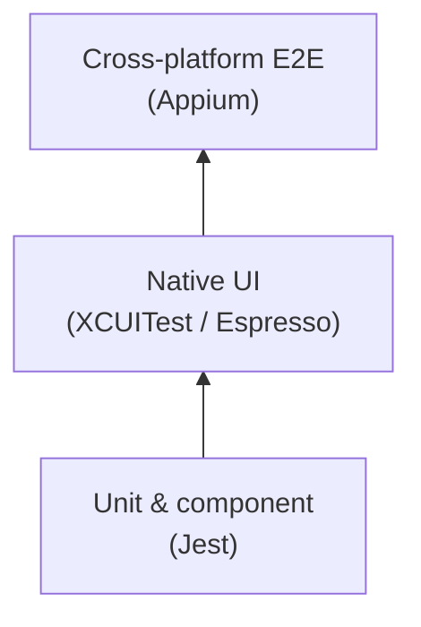
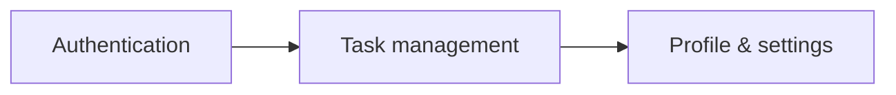
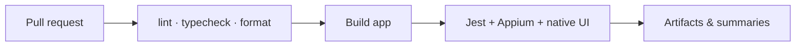

# Architecture

High-level view of the **Mobile Task Manager Automation** portfolio repository.

## Repository layout

```text
mobile-task-manager-automation/
├── app/                 # React Native application (TypeScript)
├── appium-tests/        # Cross-platform E2E (Appium + WebdriverIO)
├── ios-tests/           # Native iOS UI tests (Swift + XCUITest)
├── android-tests/       # Native Android UI tests (Kotlin + Espresso)
└── docs/                # Architecture and contributor guides
```

## System diagram



## Test pyramid



| Layer              | Location                       | Purpose                                      |
| ------------------ | ------------------------------ | -------------------------------------------- |
| Unit               | `app/__tests__`                | Business logic, hooks, utilities             |
| Native UI          | `ios-tests/`, `android-tests/` | Platform-specific flows, fast feedback on CI |
| Cross-platform E2E | `appium-tests/`                | Full user journeys on both platforms         |

## Selector strategy

Shared **accessibility identifiers** (`testID` in React Native) are the contract between:

1. Application UI
2. Appium page objects
3. XCUITest and Espresso queries

This keeps tests stable when visual styling changes.

## Application modules (planned)



### Authentication

- Login / logout
- Form validation
- Remember session (AsyncStorage)

### Tasks

- CRUD, completion toggle
- Search, filter (status, priority), sort (due date)

### Profile & settings

- User profile, theme switcher
- Clear local data, about screen

## CI pipeline (planned)



Jobs will run on GitHub-hosted macOS (iOS Simulator) and Linux (Android Emulator) runners.
